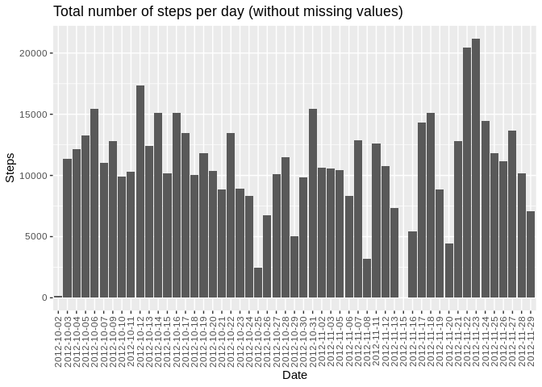
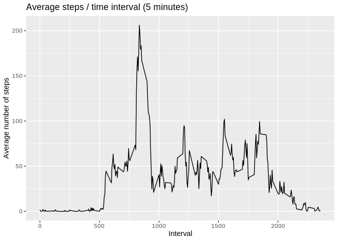
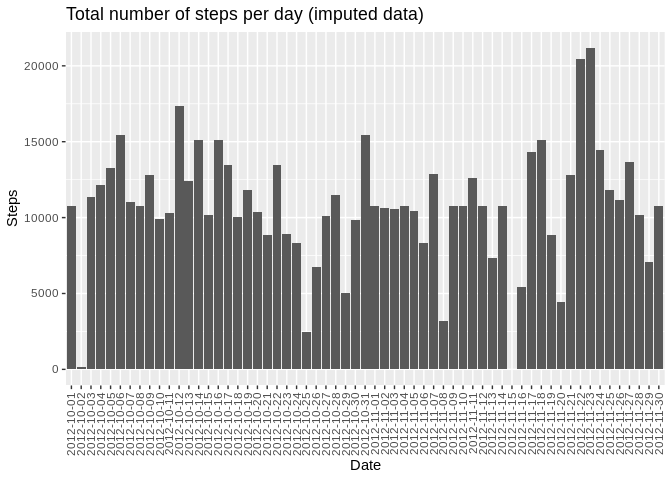
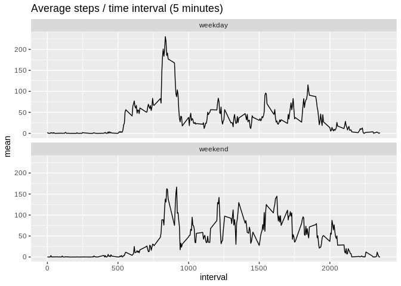

## Loading and preprocessing the data

First we set up some libraries, unzip the data and load it into R


```r
library(dplyr)
library(knitr)
library(ggplot2)
```


```r
unlink("data", recursive=TRUE)
dir.create("data")
unzip("activity.zip", exdir="data")

activity <- read.csv(file.path("data", "activity.csv"))

dim(activity)
```

```
## [1] 17568     3
```


### What is mean total number of steps taken per day?

> For this part of the assignment, you can ignore the missing values in
> the dataset.
>
> 1. Make a histogram of the total number of steps taken each day
>
> 2. Calculate and report the **mean** and **median** total number of steps taken per day


Subset the activity data frame, removing missing values. Calculate the total number of steps per day.
Make a histogram of the total number of steps taken each day.


```r
activityWithoutNa <- subset(activity, !is.na(activity$steps))
totalStepsPerDay <- activityWithoutNa %>%
    group_by(date) %>%
    summarise(sum = sum(steps), .groups = 'keep')

ggplot(totalStepsPerDay, aes(x=date, y=sum)) +
    geom_bar(stat="identity") +
    xlab("Date") +
    ylab("Steps") +
    ggtitle("Total number of steps per day (without missing values)") +
    theme(axis.text.x=element_text(angle=90, hjust=1, vjust=0.5))
```

<!-- -->

Calculate the mean and median number of steps taken per day.


```r
meanStepsPerDay <- mean(totalStepsPerDay$sum)
medianStepsPerDay <- median(totalStepsPerDay$sum)
```

The mean number of steps per day: **meanStepsPerDay = 10766.19.**

The median number of steps per day: **medianStepsPerDay = 10765.**


## What is the average daily activity pattern?

> 1. Make a time series plot (i.e. `type = "l"`) of the 5-minute interval (x-axis) and the average number of steps taken, averaged across all days (y-axis)
>
> 2. Which 5-minute interval, on average across all the days in the dataset, contains the maximum number of steps?

Make a time series plot of the 5-minute interval (x-axis) and the average number of steps taken, averaged across all days (y-axis)


```r
meanStepsPerInterval <- activityWithoutNa %>%
    group_by(interval) %>%
    summarise(mean = mean(steps), .groups = 'keep')

ggplot(meanStepsPerInterval, aes(x=interval, y=mean)) +
    geom_line() +
    xlab("Interval") +
    ylab("Average number of steps") +
    ggtitle("Average steps / time interval (5 minutes)")
```

<!-- -->

Which 5-minute interval, on average across all the days in the dataset, contains the maximum number of steps?


```r
whichIsMax <- meanStepsPerInterval[which.max(meanStepsPerInterval$mean),]$interval
```

The five minute interval which has the maximum number of steps: **whichIsMax = 835.**

## Imputing missing values

> Note that there are a number of days/intervals where there are missing
> values (coded as `NA`). The presence of missing days may introduce
> bias into some calculations or summaries of the data.
>
> 1. Calculate and report the total number of missing values in the dataset (i.e. the total number of rows with `NA`s)
>
> 2. Devise a strategy for filling in all of the missing values in the dataset. The strategy does not need to be sophisticated. For example, you could use the mean/median for that day, or the mean for that 5-minute interval, etc.
>
> 3. Create a new dataset that is equal to the original dataset but with the missing data filled in.
>
> 4. Make a histogram of the total number of steps taken each day and Calculate and report the **mean** and **median** total number of steps taken per day. Do these values differ from the estimates from the first part of the assignment? What is the impact of imputing missing data on the estimates of the total daily number of steps?

Calculate and report the total number of missing values in the dataset (i.e. the total number of rows with NAs)


```r
totalNumberOfMissingValues <- sum(is.na(activity$steps))
```


The number of missing values is: **totalNumberOfMissingValues = 2304.**


Devise a strategy for filling in all of the missing values in the dataset. The strategy does not need to be sophisticated. For example, you could use the mean/median for that day, or the mean for that 5-minute interval, etc.

**We will use the mean value for that 5 minute interval**

Create a new dataset that is equal to the original dataset but with the missing data filled in.

First add the mean of the steps per interval to the activity dataset, then update the steps value in the data set with that mean if the current value of the steps is NA:


```r
meanDataFrame <- data.frame(interval=meanStepsPerInterval$interval, mean=meanStepsPerInterval$mean)
imputedActivity <- merge(x=activity, y=meanDataFrame) %>% mutate(steps = ifelse(is.na(steps), mean, steps))

dim(imputedActivity)
```

```
## [1] 17568     4
```

Make a histogram of the total number of steps taken each day with the imputed data.


```r
imputedTotalStepsPerDay <- imputedActivity %>%
    group_by(date) %>%
    summarise(sum = sum(steps), .groups = 'keep')

ggplot(imputedTotalStepsPerDay, aes(x=date, y=sum)) +
    geom_bar(stat="identity") +
    ggtitle("Total number of steps per day (imputed data)") +
    xlab("Date") +
    ylab("Steps") +
    theme(axis.text.x=element_text(angle=90, hjust=1, vjust=0.5))
```

<!-- -->

Calculate and report the mean and median total number of steps taken per day.


```r
meanImputedStepsPerDay <- mean(imputedTotalStepsPerDay$sum)
medianImputedStepsPerDay <- median(imputedTotalStepsPerDay$sum)
```

The mean number of steps per day: **meanImputedStepsPerDay = 10766.19.**

The median number of steps per day: **medianImputedStepsPerDay = 10766.19.**

Do these values differ from the estimates from the first part of the assignment? What is the impact of imputing missing data on the estimates of the total daily number of steps?


```r
kable(data.frame(
    mean = c(meanStepsPerDay,meanImputedStepsPerDay),
    median = c(medianStepsPerDay,medianImputedStepsPerDay),
    row.names=c("without imputed values", "with imputed values"))
)
```


|                       |     mean|   median|
|:----------------------|--------:|--------:|
|without imputed values | 10766.19| 10765.00|
|with imputed values    | 10766.19| 10766.19|

With the chosen imputation method, there is **no change between the mean values but the median value has changed**.

## Are there differences in activity patterns between weekdays and weekends?


> For this part the `weekdays()` function may be of some help here. Use
> the dataset with the filled-in missing values for this part.
>
> 1. Create a new factor variable in the dataset with two levels -- "weekday" and "weekend" indicating whether a given date is a weekday or weekend day.
>
> 2. Make a panel plot containing a time series plot (i.e. `type = "l"`) of the 5-minute interval (x-axis) and the average number of steps taken, averaged across all weekday days or weekend days (y-axis).

Create a new factor variable in the dataset with two levels – "weekday" and "weekend" indicating whether a given date is a weekday or weekend day. Group by the factor and the interval, and plot the result in a panel plot.


```r
imputedMeanStepsPerInterval <- imputedActivity %>%
    mutate(typeOfDay := as.factor(ifelse(as.POSIXlt(as.Date(date))$wday %in% c(0,6), "weekend", "weekday"))) %>%
    group_by(typeOfDay, interval) %>%
    summarise(mean = mean(steps), .groups='keep')

ggplot(imputedMeanStepsPerInterval, aes(x=interval, y=mean)) +
    geom_line() +
    facet_wrap(~typeOfDay, nrow = 2) +
    ggtitle("Average steps / time interval (5 minutes)")
```

<!-- -->


